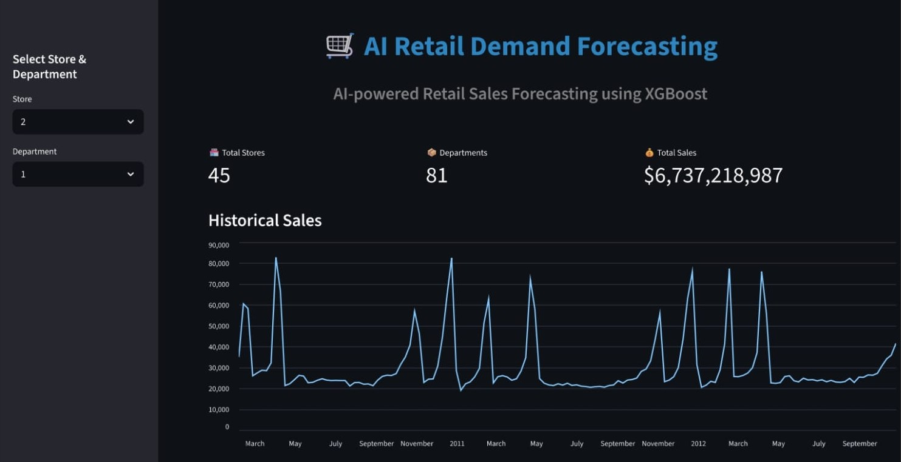
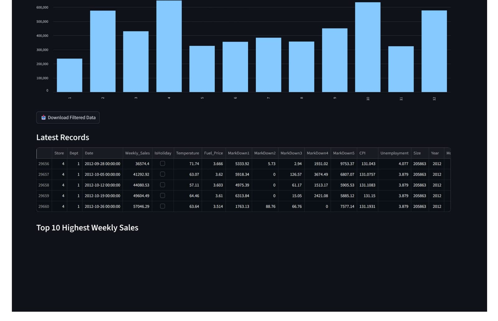
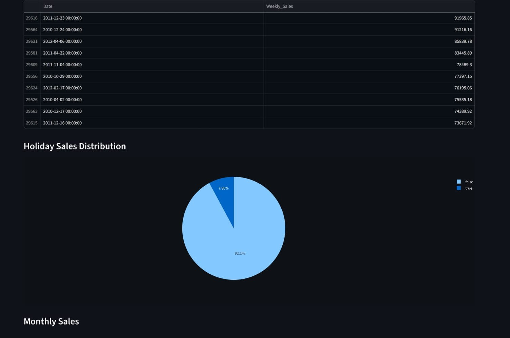
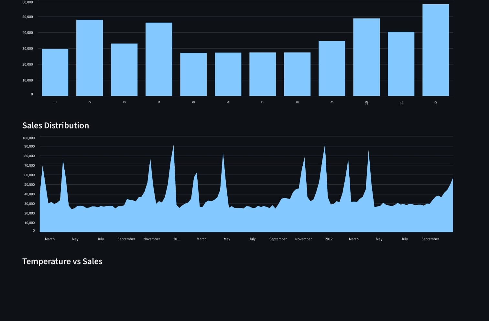
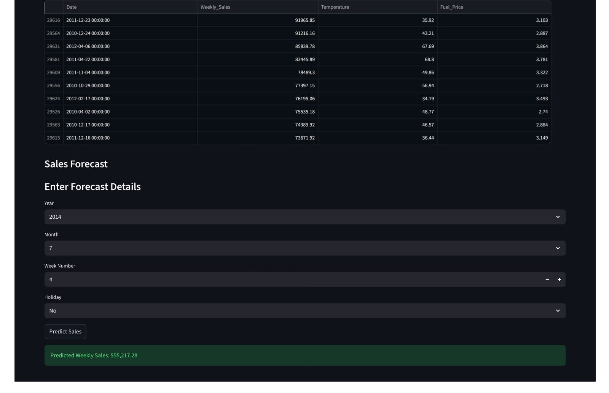
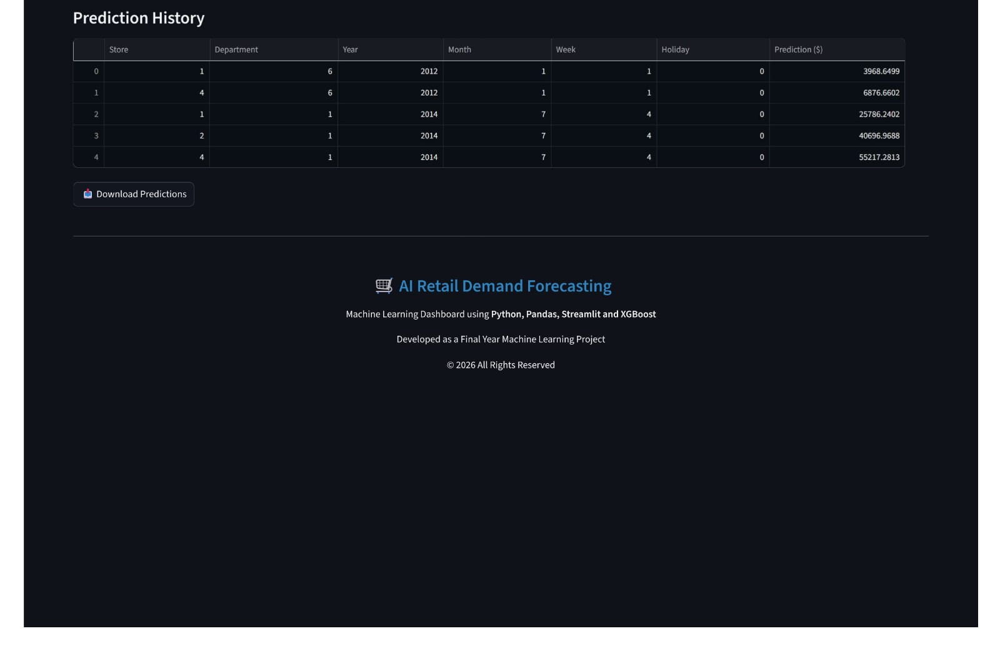

# 🛒 AI Retail Demand Forecasting

## 🚀 Live Demo

**Streamlit App:**  
https://ai-retail-demand-forecast.streamlit.app/

## 📂 GitHub Repository

https://github.com/Mano-31/Retail_Demand_Forecasting


## 📌 Project Overview

AI Retail Demand Forecasting is a Machine Learning project that predicts weekly retail sales using historical Walmart sales data. The project applies data preprocessing, feature engineering, and an XGBoost regression model to forecast future sales. A Streamlit dashboard is used to visualize sales trends and generate predictions interactively.

---

# 🎯 Objectives

- Predict weekly retail sales using Machine Learning.
- Analyze historical sales trends.
- Compare holiday and non-holiday sales.
- Visualize sales using interactive charts.
- Provide an easy-to-use forecasting dashboard.

---

# 🛠 Technologies Used

- Python
- Pandas
- NumPy
- Scikit-learn
- XGBoost
- Streamlit
- Plotly
- Joblib
- Git
- Docker

---

# 📂 Project Structure

```
Retail_Demand_Forecasting/
│
├── api/
│
├── dashboard/
│   └── app.py
│
├── data/
│   ├── raw/
│   └── processed/
│
├── images/
│   ├── dashboard_home.png
│   ├── historical_sales.png
│   ├── monthly_sales.png
│   ├── holiday_sales.png
│   ├── sales_distribution.png
│   ├── temperature_vs_sales.png
│   ├── sales_forecast.png
│   ├── prediction_history.png
│   └── project_workflow.png
│
├── models/
│   └── xgboost.pkl
│
├── notebooks/
│
├── reports/
│
├── src/
│   ├── __init__.py
│   ├── data_preprocessing.py
│   ├── feature_engineering.py
│   └── train_model.py
│
├── Dockerfile
├── requirements.txt
├── README.md
└── .gitignore
```

---

# 📊 Dataset

Dataset: Walmart Retail Sales Dataset

Features include:

- Store
- Department
- Weekly Sales
- Date
- IsHoliday
- Temperature
- Fuel Price
- CPI
- Unemployment
- MarkDown1
- MarkDown2
- MarkDown3
- MarkDown4
- MarkDown5
- Store Size
- Store Type

---

# ⚙ Data Preprocessing

The following preprocessing steps were performed:

- Removed missing values
- Converted Date to datetime format
- Extracted Year, Month, Week, Quarter
- Created Lag Features
- Created Rolling Mean
- Created Rolling Standard Deviation
- Created Total Markdown feature
- Created Sales per Size feature
- One-hot encoded Store Type

---

# 🤖 Machine Learning Model

Algorithm Used:

**XGBoost Regressor**

Why XGBoost?

- High prediction accuracy
- Fast training
- Handles missing values
- Prevents overfitting
- Suitable for tabular data

---

# 📈 Dashboard Features

The Streamlit dashboard includes:

- Dashboard Overview
- KPI Cards
- Historical Sales Chart
- Monthly Sales Trend
- Holiday vs Non-Holiday Sales
- Average Monthly Sales
- Sales Distribution
- Temperature vs Sales
- Sales Insights
- Top 10 Highest Weekly Sales
- Holiday Sales Pie Chart
- Sales Forecast
- Prediction History
- Download CSV Reports

---

# 📷 Dashboard Screenshots

## Dashboard Home




---

## Monthly Sales Trend



---

## Holiday Sales



---

## Sales Distribution




---

## Sales Forecast



---

## Prediction History



---

# 🔄 Project Workflow

```
Dataset
      │
      ▼
Data Preprocessing
      │
      ▼
Feature Engineering
      │
      ▼
Train XGBoost Model
      │
      ▼
Model Evaluation
      │
      ▼
Save Model (.pkl)
      │
      ▼
Streamlit Dashboard
      │
      ▼
Retail Sales Forecast
```

---

# 🚀 Installation

Clone the repository

```bash
git clone https://github.com/yourusername/Retail_Demand_Forecasting.git
```

Move into the project folder

```bash
cd Retail_Demand_Forecasting
```

Install dependencies

```bash
pip install -r requirements.txt
```

Run the dashboard

```bash
streamlit run dashboard/app.py
```

---

# 📥 Download Features

The dashboard allows users to download:

- Filtered Sales Data
- Prediction History

Both are exported as CSV files.

---

# 📌 Model Prediction

The user selects:

- Store
- Department
- Year
- Month
- Week
- Holiday

The trained XGBoost model predicts the expected Weekly Sales.

---

# 📊 Results

- Accurate weekly sales forecasting
- Interactive visualization
- Easy-to-use Streamlit interface
- Downloadable prediction reports
- Real-time sales prediction

---

# 🔮 Future Enhancements

- Deploy on Streamlit Cloud
- Add Deep Learning models
- Real-time API integration
- Email report generation
- Inventory optimization
- Multi-store forecasting

---

# 👨‍💻 Author

**Manogaran P**

AI & Machine Learning Project

---

# 📜 License

This project is developed for educational and learning purposes.

MIT License.

---

# ⭐ If you like this project

Please give this repository a ⭐ on GitHub.